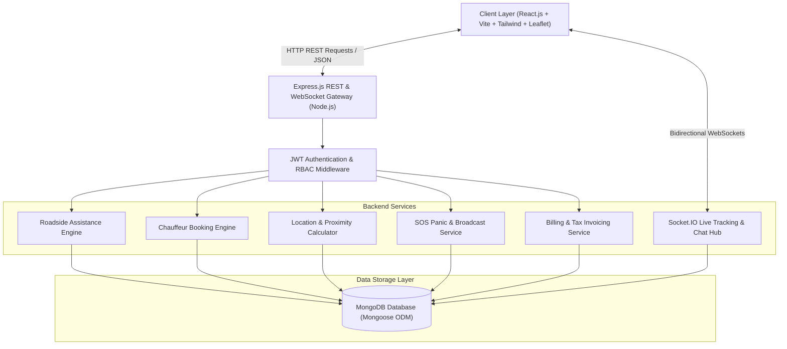
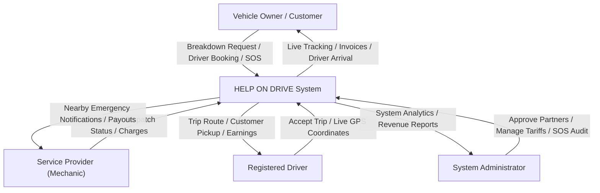
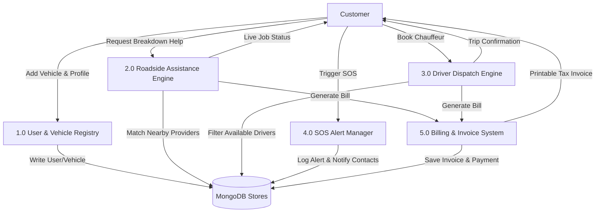
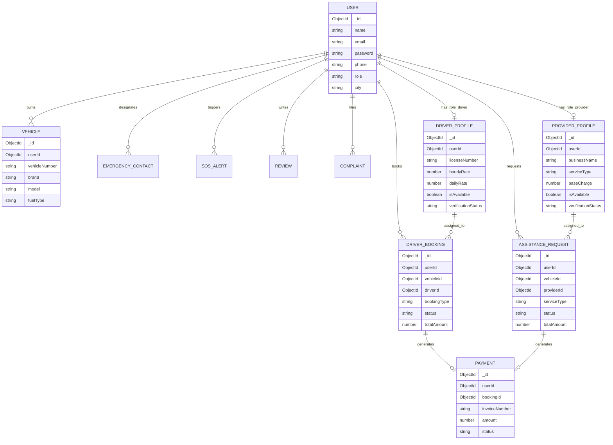
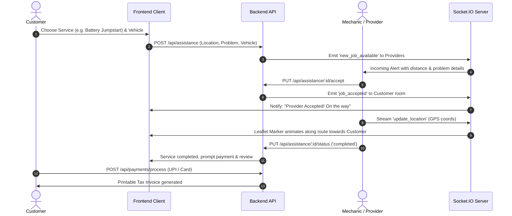
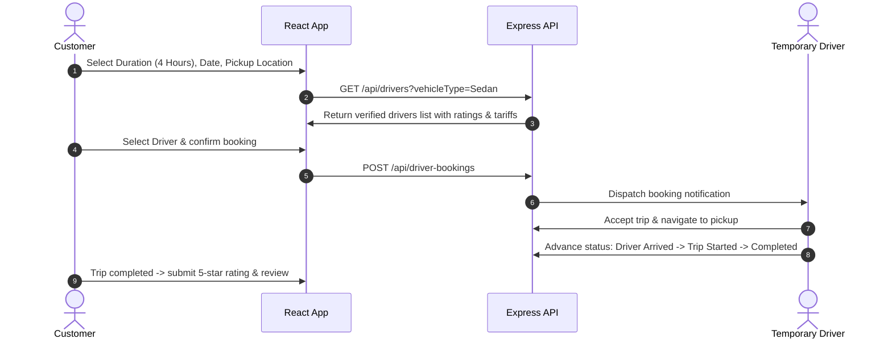
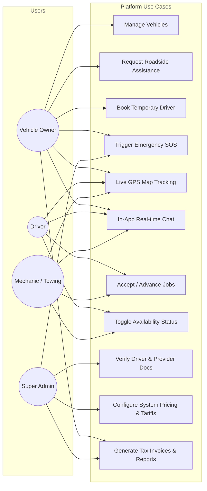

# SYSTEM ARCHITECTURE & DIAGRAMS
## HELP ON DRIVE - Roadside Assistance & Driver Booking Platform

---

### 1. High-Level System Architecture

---

### 2. Data Flow Diagrams (DFD)

#### 2.1 DFD Level 0 (Context Level Diagram)

#### 2.2 DFD Level 1 (Major System Subsystems)

---

### 3. Entity-Relationship Diagram (ERD)

---

### 4. Sequence Diagrams

#### 4.1 Roadside Assistance Dispatch Flow

#### 4.2 On-Demand Driver Booking Flow

---

### 5. Use Case Diagram

